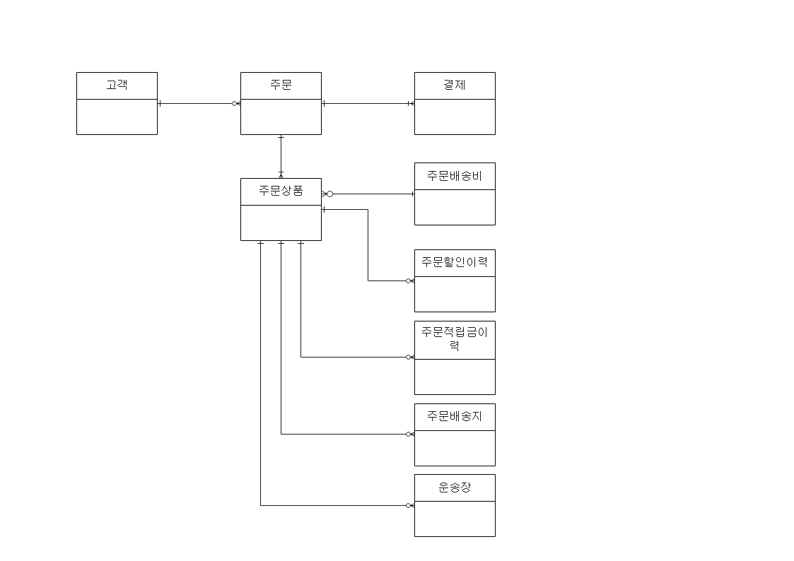

 2022.07.20. 10:50 AM 

# 주문 프로세스

### 주문 관련 테이블 관계

## 주문상품(TB_OD_ORD_GDS)

* 메인상품여부는 사은품을 포함하고 있는 일반상품과 일반적으로 주문하는 일반상품
* Q. 사은품여부는 상품구분코드와 상품유형코드를 확인하여 서비스에서 판단하는지

* 메인상품주문순번은 메인상품에 딸린 그룹의 메인상품의 주문 순번임

|상품|주문ID|주문순번|메인상품여부|사은품포함여부|사은품여부|메인상품주문순번|
|:---:|:---:|:---:|:---:|:---:|:---:|:---:|
|A|1|1|Y|Y|N|NULL|
|B|1|2|N|Y|Y|1|
|C|1|3|Y|Y|N|NULL|
|D|1|4|N|N|Y|3|

1. 사은품프로모션ID 는 시스템프로모션ID로 정산을 위한 데이터 (주문 당시의 프로모션 정보를 세팅)
2. 사은품사유코드는 인위적인 입력값
    - 주문 생성 이후 관리자가 임의로 주는 사은품은 어떻게 처리하는 걸까
    - 코드값 없음
3. 상품M의 배송소요기간 + 주문접수일시 = 배송예정일시
    - 결제 완료 때 생성
4. 평균배송기간(?) + 주문접수일시 = 출고지시일시
    - 결제 완료 때 생성
5. Q. 평균배송소요기간은 어디서 가져옴?
6. 배송준비일시: 협력사가 배송정보 다운로드
7. 배송시작일시: 협력사가 운송장 등록
8. 배송완료일시: 운송장업체에서 반환한 배송완료일시
9. 배송사배송완료일시: 운송업체의 배송사의 배송완료일시
10. 매출확정일시: 매출확정일시는 보통 배송완료일시와 같은 일시가 저장되나 고객사요구사항에 따라 달라질 수 있음
    - 예) 주말 제외시킬 수도 있음
11. ~일시는 주문상태코드와 연관지어 생각해야 함
12. 업무상 배송완료일시를 강제 update시킬 수도 있음
    - 입고도 안되었는데 배송준비중 -> 배송중으로 상태 바꿔버린 크록스
    - 운송장도 등록 안 해놨는데 배송준비중
    - 배송지연으로 인한 주문 취소나 반품을 시켜야 하는데 이미 배송중이므로 반품만 가능
    - 배송도 되지 않은 주문상품의 반품 처리 예) 최근 크록스 하이커 주문 취소
        - 이 경우는 판매자가 배송완료 처리 후 판매자가 직접 반품 접수, 반품승인까지 처리
        - 적립금 배치 연관
13. 배송수량
    - 당사의 운송장 관리는 직접하는 게 가능하므로 운송장 여러 개를 등록할 수 있음
    - 배송수량 update도 직접 할 수 있음
    - 배송수량 = 주문수량일 때 배송완료 처리 가능
14. 취소수량, 반품접수수량
    - 취소/반품유효수량 = 주문수량 - 취소수량 - 반품접수수량
    - 부분취소 및 주문 상태 고려 필요
    - 주문 취소는 철회 불가능 (다시 주문하세요) (매출 미반영 상태)
    - 반품 취소는 철회 가능 (매출 반영 연관), 반품접수수량 update 필요
15. 선환불대상여부
    - 선환불이 가능할 때 이 상품을 선환불 해줄지
    - 고객이 클레임할 경우 선환불해줘야 할 수도 있음
    - Q. 선환불대상여부 상품M에 추가되어야 하는지
16. 환불구분코드
    - (선환불/후환불)
    - 회수완료 전 환불 / 회수완료 및 검수 후 환불

* Q. 배송지 변경 시 추가 주문 배송비
    - 도서산간 or 제주도로 변경
    - 결제테이블, 배송비테이블 insert? update?
    - 결제그룹ID와 연관되는지
* 상품상세페이지에서 구매 클릭 -> 주문서 이동하여 구매
    - 프로모션ID, 할인금액
    - 쿠폰
    - Q. 유효성 검증 필요

* Q. 사은품_회수_필요_여부
    - 상품M에 사은품회수여부 혹은 사은품회수필수여부 없음
* 상품은 일반/사은품만 사용
    - 사은품은 이벤트 경품용으로만 관리
    - Q. 주문 때 미포함되므로 주문상품에 있는 사은품에 관한 컬럼들 사용하지 않는 걸까