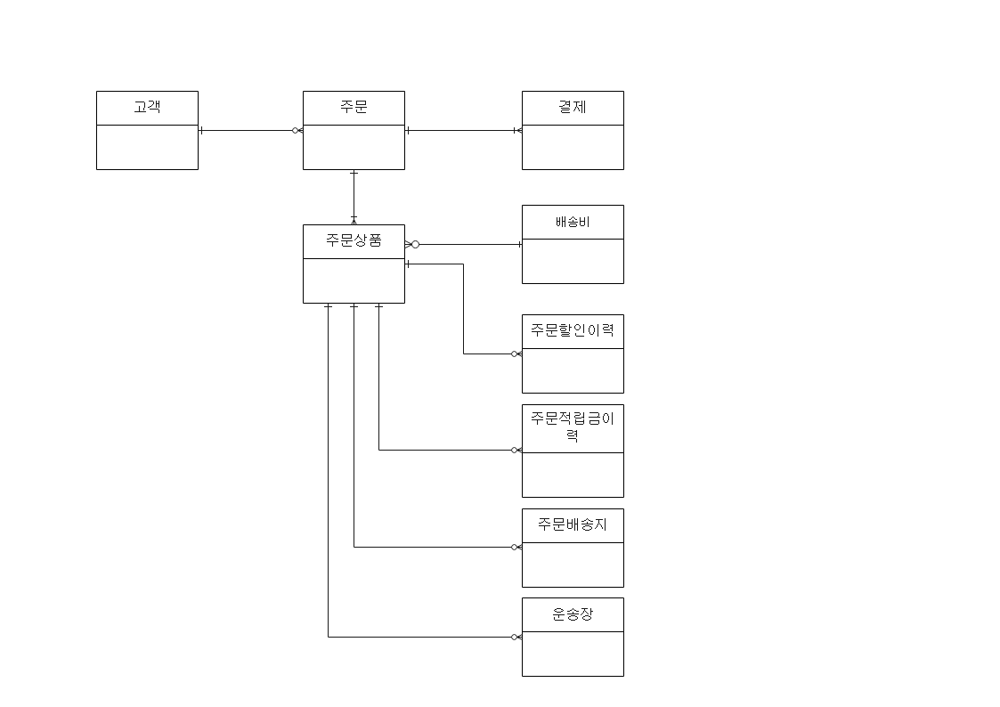

 2022.07.20. 10:50 AM 

# 주문 프로세스

### 주문 관련 테이블 관계도

## 주문상품(TB_OD_ORD_GDS)

1. 메인상품여부 Y
    - 사은품을 포함하고 있는 일반상품과 일반적으로 주문하는 일반상품
    - Q. 사은품여부는 상품구분코드와 상품유형코드를 확인하여 서비스에서 판단하는지

2. 메인상품주문순번은 메인상품에 딸린 그룹의 메인상품의 주문 순번

|상품|주문ID|주문순번|메인상품여부|사은품포함여부|사은품여부|메인상품주문순번|
|:---:|:---:|:---:|:---:|:---:|:---:|:---:|
|A|1|1|Y|Y|N|NULL|
|B|1|2|N|Y|Y|1|
|C|1|3|Y|Y|N|NULL|
|D|1|4|N|N|Y|3|

3. 사은품프로모션ID 는 시스템 프로모션ID로 정산을 위한 데이터
    - 주문 당시의 프로모션 정보를 세팅
4. 사은품사유코드는 인위적인 입력값
    - **Q. 코드값 존재하지 않음**
    - 프로모션 사은품으로 있지 않고 주문 생성 이후 고객 클레임 대응으로 MD가 임의로 줄 수도 있을 때 사용
        - Q. 이 경우 로직 처리 어떻게 하는지
5. 출고 및 배송과 관련된 일시는 주문상태코드와 연관지어 생각해야 함
6. 결제 완료 시 출고일시, 배송예정일시 세팅
    - 출고지시일시 = 주문접수일시 + 1
    - 배송예정일시 = 상품M의 배송소요기간 + 주문접수일시
    - 평균배송소요기간은 상품M의 배송소요기간
7. 배송준비일시: 협력사가 SCM에서 주문내역을 다운로드할 때
8. 배송시작일시: 협력사가 운송장 등록
9. 배송완료일시: 운송 업체에서 받은 배송완료일시 정보
10. 배송사배송완료일시: 운송 업체에서 받은 배송사의 배송완료일시 정보
11. 매출확정일시: 매출확정일시는 보통 배송완료일시와 같은 일시가 저장되나 고객사요구사항에 따라 달라질 수 있음
    - 예) 고객사에서 매출일시에 주말 제외를 요구할 시
12. 업무상 배송완료일시를 강제 update시킬 수도 있음
    - 예) 롯데ON 사례 - 상품 크록스
        - 상품이 입고도 안된 상태에서 판매자가 먼저 배송준비중 -> 배송중으로 변경 가능
        - 운송장도 없음
        - 소비자가 배송지연으로 인한 주문 취소 요구 그러나 주문상태가 이미 배송중이므로 반품만 가능
        - 이 경우는 판매자가 직접 배송완료(운송장 안 나왔어도), 반품 접수, 반품승인까지 처리
    - 적립금 batch 고려
13. 배송수량
    - 당사의 운송장 관리의 경우 직접 관리가 가능하므로 운송장 여러 개를 등록할 수 있음
        - 배송수량 update 도 가능
        - 배송수량 = 주문수량일 때 배송완료 처리 가능
14. 취소수량, 반품접수수량
    - 취소/반품유효수량 = 주문수량 - 취소수량 - 반품접수수량
        - 부분취소 및 주문 상태 고려 필요
    - 주문 취소는 철회 불가능
        - 매출 미반영 상태
        - 다시 주문해야 하는 게 더 편리
    - 반품 취소는 철회 가능
        - 반품접수수량 update 필요
        - 매출 반영 후이기 때문에 철회 시 이득
15. 선환불대상여부
    - 선환불이 가능할 때 이 상품을 선환불 해줄지
    - 고객이 클레임할 경우 선환불해줘야 할 수도 있음
    - Q. 선환불대상여부 상품M에 추가되어야 하는지
16. 환불구분코드
    - (선환불/후환불)
    - 회수완료 전 환불 / 회수완료 및 검수 후 환불

* Q. 배송지 변경 시 추가 주문 배송비
    - 도서산간 or 제주도로 변경
    - 결제테이블, 배송비테이블 insert? update?
    - 결제그룹ID와 연관되는지
* 상품상세페이지에서 구매 클릭 -> 주문서 이동하여 구매
    - 프로모션ID, 할인금액
    - 쿠폰
    - Q. 유효성 검증 필요

* Q. 사은품_회수_필요_여부
    - 상품M에 사은품회수여부 혹은 사은품회수필수여부 없음