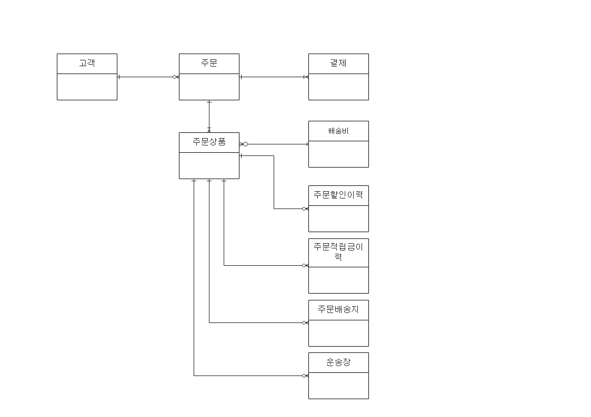

 2022.07.21. 09:00 AM, 14:00 PM 

# 취소/교환/반품

## 주문 관련 테이블 관계도

## 오전 9시
1. 주문 TEMP 테이블 없음
2. 쿠폰 및 프로모션 정보와 적용된 상품 정보는 화면에서 들고 있고 DB까지는 반영이 되지 않음
    - 비회원/회원 여부로는 결제 정보가 달라서 서버단에서 데이터를 넣어줌
3. 결제 승인 완료 후 DB 데이터 생성(할인이력, 적립금이력)
* Q. 할인 적용 순서 기준(프로모션>쿠폰 순?)
4. 할인금액은 합계가 * 할인율임 (합계가는 단위판매가 * 주문수량)
5. 주문상품 테이블은 배송비ID 갖고 있음

## 오후 2시

### 결제와 환불
* 결제와 환불 테이블의 금액 이동 주의 필요
1. 주문취소는 상품단위로 전체 수량 취소만 가능함
    - 수량 일부 취소 불가능
    - Q. 그럼 취소수량을 아예 안 받는 건가?
2. 주문 -> 카드승인
    - 카드승인정보는 TB_SC_CRCD_APRV
    - (TB_OD_STLM) 결제수단관련ID로 TB_SC_CRCD_APRV의 PK 들어감
        - 적립금 결제 시 차감하는 고객적립금ID
    - (TB_SC_CRCD_APRV) 계좌소유자명, 가상계좌번호, 입금은행코드, 예금주명, 송금인명
        - 카드 대금 기간 지나갔을 때 결제 취소 카드승인 및 환불이 바로 안 되는 문제로 고객이 클레임 들어올 시 계좌이체로 안내해줌
        - Q. 이 경우 결제/환불 테이블에 환불제외금액 update
3. 결제 성공 후
    - (TB_OD_STLM) 결제금액 == 환불가능금액
4. 주문 취소 혹은 반품 시
    - (TB_OD_STLM) (회수완료 이전일 때) 환불예정금액 update
5. 결제금액 = 환불가능금액 + 환불예정금액 + 환불제외금액 + 환불금액
6. 주문결제ID 최초생성 시 결제그룹ID는 무조건 1로 하드코딩되는지 확인하기
    - **결제수단 바꾸기 위한 재결제 시 결제그룹ID는 1로 들어가야 하는지 재확인 필요**
7. 취소 테이블은 환불정보 일치를 위해 테이블을 분리함 (취소그룹ID도 환불 테이블에 같이 추가됨)
    - Q. 취소테이블의 경우 거의 insert만 일어나게 되는데 나중에 주문 취소 상품 장바구니에 다시 추가하기 이런 기능 제공할 건지
8. (TB_OD_STLM) 의 결제예정금액은 무통장입금 관련

### 취소
|상품|수량|합계가|취소1|취소2|
|:---:|:---:|:---:|:---:|:---:|
|오렌지|2|2,0000|V|||
|사과|2|3,0000|V||
|배|2|5,0000||V|
|취소그룹ID|||1|2|
1. 취소 시 결제 테이블 update, 환불 시 insert

### 반품
1. 반품 접수 -> 환불예정금액 update -> 카드취소 승인
    - 반품수량 == 회수수량 일 시 회수확정 처리 가능
    - 같은 반품그룹 내 상품이 모두 회수완료일 때 카드취소 승인
        - 결제 테이블 update 환불예정금액(0) 환불금액, 환불테이블 insert 환불금액
        - Q. 환불테이블 환불예정금액 용도
        - Q. 환불예정금액도 무통장입금이랑 관련된 건가
2. 반품 접수 시 반품접수수량 update
3. 반품 철회 시 반품접수수량 update
4. 한 주문에 같은 단품을 1개씩 여러 개 주문했을 시
    - 주문ID, 주문순번으로 구분한다.
5. 연속적으로 교환하고 반품하는 경우
    - (A 상품 B로 교환 -> B 상품 C로 교환 -> C 상품 D로 교환 -> D 상품 반품)
    - 원주문순번은 직전교환 상품의 주문 순번 (A의 주문순번)
    - 교환이 연속적으로 이뤄져도 원주문순번이 계속 유지
    - 상이 교환은 잘 안 한다.

### 배송비
* 배송비 모듈에 따름
    - 고려사항: 배송템플릿ID, 합포장여부, 무료배송여부(+무료배송기준금액)
1. 같은 배송템플릿ID를 가지고 있는 상품 A (배송비 1,000원), B (배송비 1,000원), C (배송비 3,000원)
    - 배송비 테이블 row 1개
        - A, B 합포장 여부 Y
        - C 합포장 여부 N
        - A, B 배송비 통틀어 1,000원 + C 배송비 3,000원
        - 배송비1 4,000원
2. 각각 다른 배송템플릿ID를 가지고 있는 상품 X (배송비 1,000원), Y (배송비 1,000원), Z (배송비 3,000원)
    - 배송비 테이블 row 3개
        - 배송비1: 1,000원
        - 배송비2: 1,000원
        - 배송비3: 3,000원
3. 반품배송비도 배송비 모듈에 따름
    - 반품할 상품들의 배송템플릿, 합포장여부 고려 (무료배송비도 있는 경우 함께 고려)

### 재고차감
1. TB_PD_UNT 재고 수량 차감
    - update locking 고려