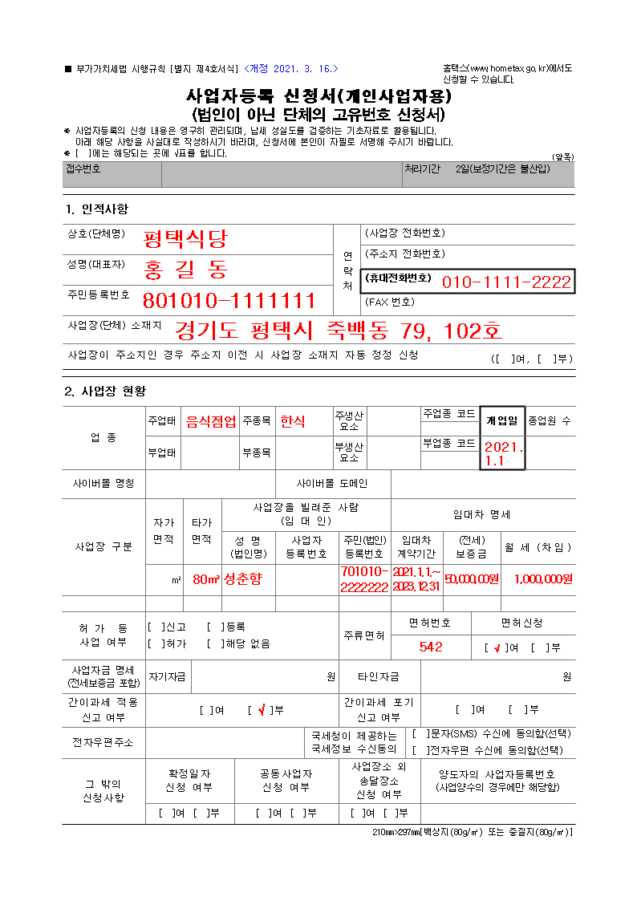
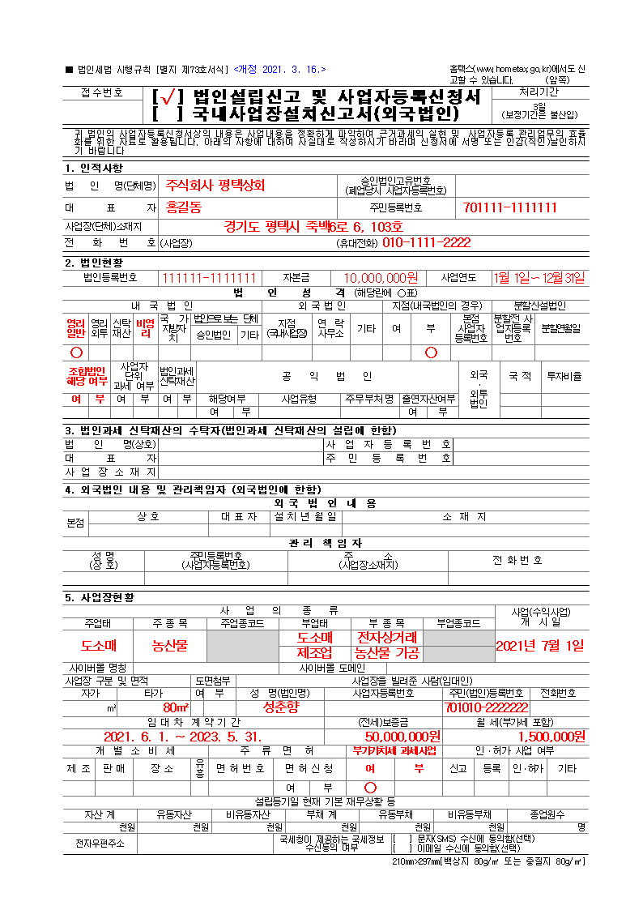

 2022.07.14 14:35, 상품 교육, 담당자 이지원 

# DAY 1

## <상품분류등록>
1. 분류 단계는 4단계까지 받고
2. 4단계가 되면 분류단계종료여부 Y
3. 현 상품 개발기준에서는 4단계까지 필수로 받고 있기 때문에 법적허가관리분류도 4단계에서 받는 것으로 고정
    - 고객사에 따라 3단계로 줄여질 가능성도 있으니 염두
4. 법적허가관리분류: 광고심의필증이 있어야 광고 및 유통이 가능한 상품들이 있음
    1. 공통코드로 관리하며 건강기능식품/의료기기/기능성화장품/특수용도식품/의약외품 이 있음
    2. 다른 종류 필요 시 추가 가능함 예) 영화
    3. 분야마다 심의기관이 다름. 심의기관에서 통과된 결과 필증이 필요함
        - 예1) 건강기능식품을 제조하려면 한국건강기능식품협회의 기능성표시 광고심의를 필수로 제출해야 온라인 판매가 가능함
        - 예2) 의료기기 산업 협회 의료기기는 의료기기 광고 사전 심의회에서 독점적으로 진행

## <정보고시품목항목조회>
1. 전자상거래 등에서의 상품 등의 정보제공에 관한 고시
    * Link : [전자상거래 등에서의 상품 등의 정보제공에 관한 고시][gosilink]
    * Link : [쿠팡 오븐에 구운 도넛][coupangovendonutlink]
2. 품목: 품목별 재화 등에 관한 정보
3. 항목: 전자상거래 등에서의 상품정보제공 고시
4. 개정으로 인한 변동성이 있음

## <상품분류 정보고시등록>
1. MD가 지정가능
2. 상품등록에서도 추가로 할 수 있으나 상품분류별 필수정보 손쉽게 등록 제공
3. 상품등록에서 추가로 설명

## <브랜드등록>
1. 배너이미지 - 쿠팡 예시 (스탠리)
    * Link : [쿠팡 스탠리][coupangstanleylink]
    * Link : [쿠팡 스탠리 브랜드샵][coupangstanleybrandshoplink]
    1. 현 개발에서 브랜드샵이 논의되지는 않았지만 고객사가 요구할 수도 있음
    2. 이번엔 브랜드도 다국어설정이 있기 때문에 브랜드영문명은 필수값으로 바뀜
    3. ~~Q. 브랜드 국문명은 어떻게 가져오는 것인가~~

## <협력사등록>
1. 사업자번호와 전화번호 등은 현재 그리드에서 없음
    1. 그리드 추가 시 개인정보이기 때문에 마스킹 필요
    2. 고객사 요구사항 추가 가능성 있음
2. 전체조회 방식이라 탭을 클릭해도 초기화되지 않음
    - 탭마다 초기화를 원할 시 초기화버튼 클릭하면 됨
3. <협력사창고>
    1. 협력사창고는 물류담당자만 담당자로 보여야 함
        - 담당자는 협력사담당자 탭에서 저장한 데이터를 dropdownlist로 보여줌
    2. 창고 주소는 도로명, 지번 모두 받음
        - 도로명이 기본
    3. 창고구분은 회수지/출고지/출고지회수지
    4. 대표전화번호는 휴대전화번호 형식이 아닐 수도 있음
4. <협력사배송템플릿>
    1. 배송사는 현재 코드로 관리 중
    2. 출고창고는 창고구분코드가 출고지 or 출고지회수지 인 협력사 창고, 회수창고는 회수지 or 출고지회수지 인 협력사 창고
        - 창고는 협력사창고 탭에서 저장한 데이터를 dropdownlist로 보여줌
    3. 상품보관유형, 상품형태 꼭 필수값
        - 상품등록에서 배송템플릿을 선택할 때 상품보관유형과 상품형태가 같은 배송템플릿 목록만 필터링해서 보여줌
    4. 합포장가능여부는 합배송가능여부임, 합배송이 가능할 시 배송비는 같이 합배송이 가능한 상품으로 묶은 뒤 책정됨
    5. 현재 배송비부과여부는 주문배송비금액, 무료배송비설정여부, 무료배송금액만 제어하고 있음.
        1. 배송비를 부과하지 않더라도 교환/반품 배송비가 존재할 수 있음
        2. 배송비부과하지 않는 것이 결국 무료배송비이고 무료배송비설정여부는 무료배송기준금액 설정을 위한 것이기 때문에 같이 비활성화 됨
        3. 배송비를 부과하지 않거나 무료배송비를 설정했어도 제주도추가배송비, 도서산간배송비를 추가로 받을 수 있음
    6. 추가 제어는 고객사 요구사항에 따름
    7. 배송/교환/반품/AS 안내는 원래 상품등록에서 관리했으나 배송템플릿에서 관리하는 것으로 변경됨
5. <기본정보> 사업자 업종/업태
    1. 사업자등록할 때 입력하는 국세청 업종/업태 코드, 코드의 표기값
    2. 업종: 사업의 종목, 판매하는 상품의 종류에 따라 분류 예) 가구, 의류, 신발
    3. 업태: 사업의 형태 상품의 판매 방법의 차이에 따른 분류 예) 도매업, 소매업
        - 영업이나 사업의 실태, 한국표준산업분류표상 영업의 종류 중 대분류에 속함. 사업의 범위, 판매하는 방법에 의한 분류
    4. 사업자등록증에 입력하는 업종 및 업태가 한 가지가 아니기 때문에 협력사등록에서는 텍스트로 입력 받음
    5. 이미지 참고
        - [개인사업자등록 서식](#별첨1-개인사업자등록서식)
        - [법인사업자등록 서식](#별첨2-법인사업자등록서식)
6. <기본정보> 협력사구분
    1. 공급사: 상품 및 물품을 공급하는 협력사
    2. 판매제휴사: 티몬 및 11번가 같은 제휴사
    3. 택배제휴사
7. 정산주기
    1. 30/25
        - 한달치를 다음달 25일에 정산
    2. 10/10
        - 10일치를 10일 뒤에 정산
        - 홈쇼핑의 경우 정산주기가 빠름
    3. 배치에는 크게 영향이 없고 정산 조회 때 주기 별로 조회할 수 있도록 역할을 함
    4. 현재 30/25만 사용 중
    <!-- * 거래처-당사 공급계약서에 따라 거래처 기준으로 정산됨
    * 결제조건은 등록되고 나면 웬만해선 안바뀜
    * 바뀌어도 다음 달이나 다음 주기부터 반영되도록 -->
## <제조사등록>
1. 제조사 관리
2. 이번에 제조사 관리 함

## < MD등록 >
1. MD 팀 관리

## < MD사용자등록 >
1. MD 팀 내 담당자 관리
2. 팀장여부까지만 받음
3. 고객사 요구사항에 따라 직급은 늘어날 수 있음
4. MD팀장은 MD팀의 장이므로 MD팀 당 1명만 있어야 함
5. 여기서 MD팀장인 사람만 해당 MD의 상품의 MD팀장승인, 가격승인 권한이 있음

## <원산지등록>
1. 원산지 관리

## <뱃지등록>
1. MALL 화면에서 쓸 뱃지 및 아이콘 관리
    1. 쿠팡 예시 (오븐에 구운 도넛)
        * Link : [쿠팡 오븐에 구운 도넛][coupangovendonutsearchlink]
        1. 여기서 1, 2, 3, 4, 5 가 뱃지 (판매량순, 1-10 있음)
        2. 로켓프레시가 아이콘
    2. 쿠팡 예시 (디즈니)
        * Link : [쿠팡 디즈니][coupangdisneylink]
        1. 여기서 1, 2, 3, 4, 5 가 뱃지 (판매량순, 1-10 있음)
        2. 로켓와우, 로켓배송, 제트배송이 아이콘
2. 따라서 이미지는 필수값
3. 뱃지/아이콘 구분은 뱃지아이콘구분코드

* * *

## 별첨
### 별첨1-개인사업자등록서식
- (출처: [국세청-사업자등록신청서(개인)작성방법][individualbizformlink])    

### 별첨2-법인사업자등록서식
- (출처: [국세청-사업자등록신청서(법인)작성방법][companybizformlink])    

<!-- 첨부 링크 -->

[gosilink]: https://www.law.go.kr/%ED%96%89%EC%A0%95%EA%B7%9C%EC%B9%99/%EC%A0%84%EC%9E%90%EC%83%81%EA%B1%B0%EB%9E%98%EB%93%B1%EC%97%90%EC%84%9C%EC%9D%98%EC%83%81%ED%92%88%EB%93%B1%EC%9D%98%EC%A0%95%EB%B3%B4%EC%A0%9C%EA%B3%B5%EC%97%90%EA%B4%80%ED%95%9C%EA%B3%A0%EC%8B%9C

[coupangstanleylink]: https://www.coupang.com/vp/products/1596362803?itemId=3106757208&vendorItemId=71094519712&trcid=370161&traid=home_CategoryBest_C3&sourceType=CATEGORY&categoryId=185704&isAddedCart=

[coupangstanleybrandshoplink]: https://www.coupang.com/np/products/brand-shop?brandName=%EC%8A%A4%ED%83%A0%EB%A6%AC

[coupangovendonutlink]: https://www.coupang.com/vp/products/338238274?itemId=1078116533&vendorItemId=82336003452&q=%EC%98%A4%EB%B8%90%EC%97%90+%EA%B5%AC%EC%9A%B4+%EB%8F%84%EB%84%9B&itemsCount=36&searchId=bd1f88e8c3c446c996d93a3be6c55296&rank=1&isAddedCart=

[coupangovendonutsearchlink]: https://www.coupang.com/np/search?component=&q=%EC%98%A4%EB%B8%90%EC%97%90+%EA%B5%AC%EC%9A%B4+%EB%8F%84%EB%84%9B&channel=user

[coupangdisneylink]: https://www.coupang.com/np/search?component=&q=%EB%94%94%EC%A6%88%EB%8B%88&channel=user

[individualbizformlink]: https://www.nts.go.kr/taxpayer_advocate/na/ntt/selectNttInfo.do?mi=40396&nttSn=1302746

[companybizformlink]: https://www.nts.go.kr/taxpayer_advocate/na/ntt/selectNttInfo.do?mi=40396&nttSn=1302747